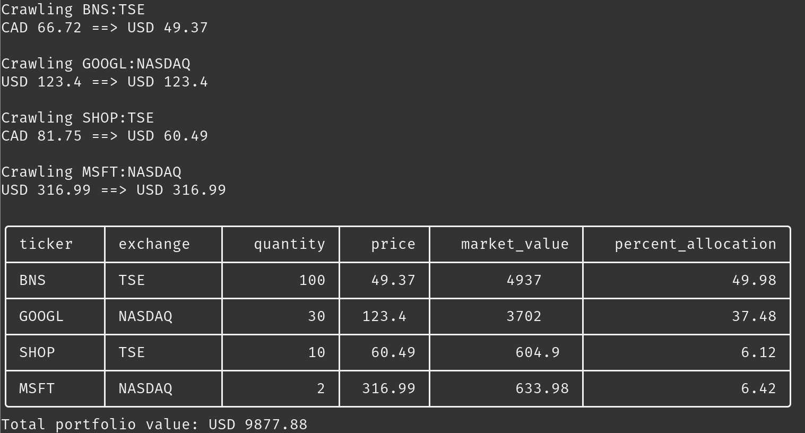
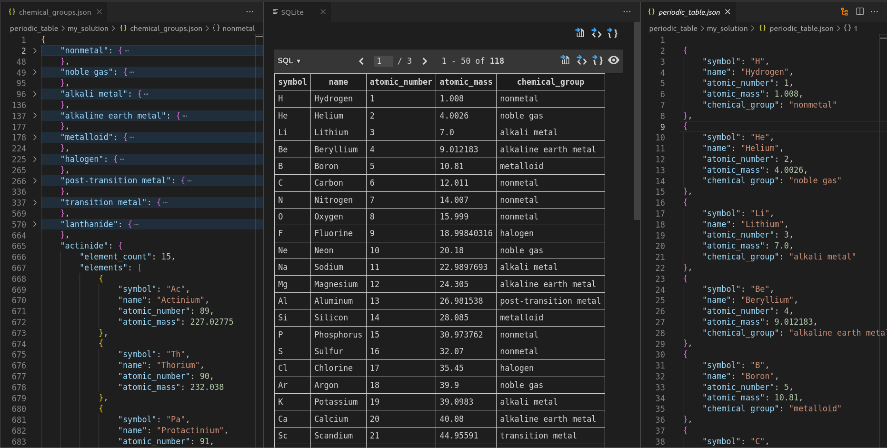

# Web Scraping Bootcamp 🕷️

Practice code for [The Ultimate Web Scraping With Python Bootcamp 2023](https://www.udemy.com/course/the-ultimate-web-scraping-with-python-bootcamp/) course.

## Syllabus

- Introduction
- The HTTP Protocol
- HTML, CSS, And JavaScript
- Web Requests In Python
- Parsing And Extraction
- Project 1 - Portfolio Valuation With Google Finance
- APIs: The Hidden Gems
- Selectolax And Advanced CSS Selectors
- Project 2 - Image Scraper
- Tackling JavaScript With Microsoft PlayWright
- Project 3 - Building A Configurable Scraping Pipeline
- The Scrapy Framework
- Boosting Scrapy With scrapy-playwright
- Project 4 - Scraping Dynamic Sites With Scrapy And PlayWright
- Closing Thoughts
- Appendix - Python Fundamentals

## Projects

### 1. [Portfolio Valuation With Google Finance 📈](https://github.com/Prajwalsrinvas/web-scraping-bootcamp/tree/master/week3/my_solution)

### 2. [Unsplash Image Scraper 🖼️](https://github.com/Prajwalsrinvas/web-scraping-bootcamp/tree/master/week5/my_solution)

### 3. [Steam Game Offers Scraper 🎮](https://github.com/Prajwalsrinvas/web-scraping-bootcamp/tree/master/week7/my_solution)

### 4. [Dynamic Periodic Table Scraper 🧪](https://github.com/Prajwalsrinvas/web-scraping-bootcamp/tree/master/week9/periodic_table/my_solution)

## Certificate

