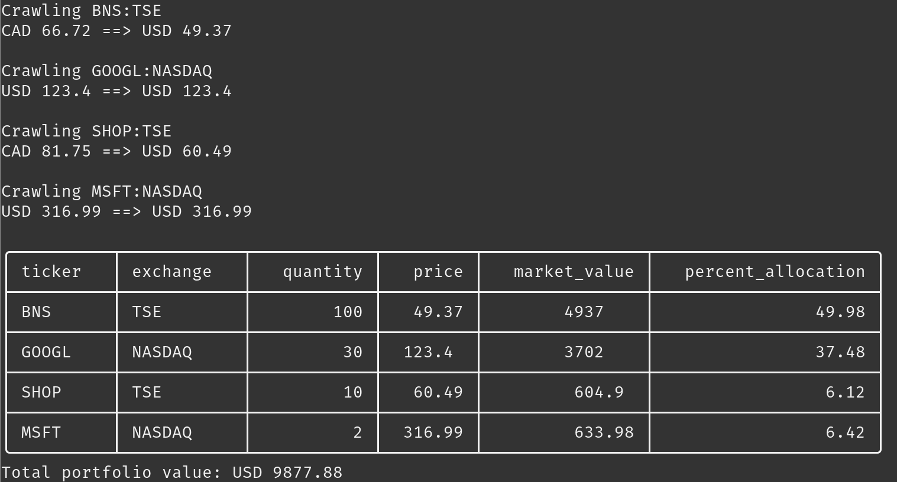

# Portfolio Valuation With Google Finance 📈

## Output

## Code Explanation

The code provided performs the following tasks:

1. It imports necessary libraries/modules: `json`, `pandas`, `requests`, and `BeautifulSoup`.
2. It reads stock information from a JSON file named "stocks.json" and stores it in the `stocks` variable.
3. It defines a function called `convert_currency` which takes a price, input currency, and output currency as parameters. The function converts the price from the input currency to the output currency using web scraping to fetch the conversion rate from Google Finance.
4. It defines a function called `get_price` which takes a stock ticker, exchange, and output currency as parameters. The function fetches the current price of the stock from Google Finance using web scraping, and then calls the `convert_currency` function to convert the price to the desired output currency.
5. It initializes variables `output_currency` and `total_portfolio_value`.
6. It iterates over each stock in the `stocks` variable and calls the `get_price` function to fetch the price of each stock. It then calculates the market value of each stock by multiplying the price with the quantity. The `price` and `market_value` are added to each stock's dictionary.
7. It calculates the `total_portfolio_value` by summing up the market values of all stocks.
8. It calculates the percentage allocation of each stock in the portfolio and adds the `percent_allocation` key to each stock's dictionary.
9. It prints the stock information in a tabular format using the `to_markdown` function from the `pandas` library.
10. It prints the total portfolio value.

## Suggestions for Improvement

1. **Modularize the code:** Instead of having a single large script, it would be beneficial to modularize the code into smaller functions or classes. This would make the code more readable, maintainable, and testable.

2. **Error handling:** The code assumes that the web scraping and JSON operations will always succeed. It is advisable to include proper error handling mechanisms such as try-except blocks to handle exceptions and provide appropriate error messages to the user.

3. **Separate configuration:** Instead of hardcoding the file name "stocks.json" in the code, it would be better to provide it as a configurable parameter or use a command-line argument to specify the file name. This allows for flexibility and reusability of the code.

4. **Input validation:** Validate the input data from the JSON file before processing it. Ensure that the required fields are present and have the correct data types. Handle cases where the input data is invalid or missing.

5. **Reuse HTTP connections:** Consider using session objects from the `requests` library to reuse HTTP connections and improve performance when making multiple requests to the same domain.

6. **Data structures and types:** Use appropriate data structures and types to represent the stock data. Consider using namedtuples, data classes, or custom classes to encapsulate the stock information and perform operations on it more efficiently.

7. **Code style and documentation:** Follow Python's PEP 8 style guide for consistent code formatting. Add docstrings to functions and classes to provide clear explanations of their purpose, parameters, and return values.

8. **Unit tests:** Write unit tests to verify the correctness of the functions and classes. This helps in catching bugs early and ensures that the code behaves as expected when changes are made.

9. **Caching and rate limiting:** Consider implementing caching mechanisms to avoid unnecessary web scraping requests. Also, be mindful of rate limits imposed by websites to avoid potential IP blocking or disruption of service.

10. **Concurrency and asynchronous processing:** If performance is a concern, consider using concurrency techniques or asynchronous processing to fetch stock prices in parallel, making the program more efficient.

These suggestions aim to enhance the code's readability, maintainability, performance, and reliability.

