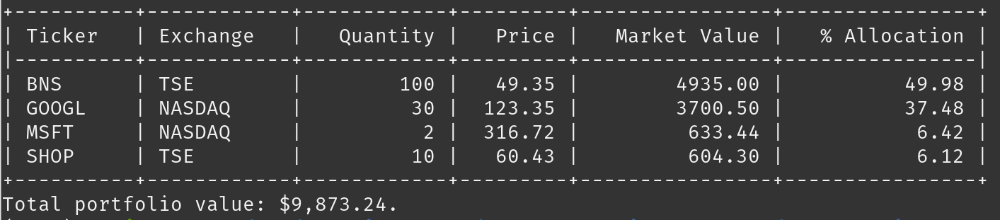

# Portfolio Valuation With Google Finance (official solution) 📈

## Output

## Code Explanation

The provided code performs the following tasks:

1. It imports necessary libraries/modules: `dataclass` from `dataclasses`, `requests` as `r`, `BeautifulSoup` from `bs4`, and `tabulate` for tabular display.
2. It defines a function `get_fx_to_usd` that fetches the exchange rate of a given currency to USD from Google Finance using web scraping. It returns the exchange rate as a float.
3. It defines a function `get_price_information` that fetches the price information for a stock given its ticker symbol and exchange. It retrieves the price and currency code from Google Finance using web scraping. If the currency is not USD, it calls `get_fx_to_usd` to convert the price to USD. The function returns a dictionary containing the stock's ticker, exchange, price, currency, and USD price.
4. It defines a `Stock` dataclass that represents a stock. It includes attributes for ticker, exchange, price, currency, and USD price. It also defines a `__post_init__` method that initializes the stock's price information by calling `get_price_information` based on the ticker and exchange provided.
5. It defines a `Position` dataclass that represents a stock position. It includes attributes for the stock and quantity.
6. It defines a `Portfolio` dataclass that represents a collection of positions. It includes an attribute for a list of positions and a method `get_total_value` that calculates the total value of the portfolio by summing the product of each position's quantity and the stock's USD price.
7. It defines a function `display_portfolio_summary` that displays a summary of the portfolio. It takes a `Portfolio` instance as input. It retrieves the total value of the portfolio using `get_total_value` and constructs a table of position data including ticker, exchange, quantity, price, market value, and percentage allocation. The table is displayed using the `tabulate` function. Finally, it prints the total portfolio value.
8. It creates instances of `Stock` for different stocks (e.g., SHOP, MSFT, GOOGL, BNS) and provides the ticker symbol and exchange for each stock. These instances represent the stocks in the portfolio.
9. It creates instances of `Position` using the stock instances and quantity for each stock. These instances represent the positions in the portfolio.
10. It creates an instance of `Portfolio` using the positions created and assigns it to the `portfolio` variable.
11. It calls `display_portfolio_summary` with the `portfolio` instance to display the portfolio summary.

## Suggestions for Improvement

1. **Code Organization:** The code is well-structured using dataclasses and separates concerns into different classes and functions. However, it would be beneficial to further modularize the code into smaller functions or methods to improve readability and maintainability.

2. **Error Handling:** Consider adding appropriate error handling mechanisms such as try-except blocks to handle exceptions that may occur during web scraping or other operations. Provide meaningful error messages or logging to aid in troubleshooting.

3. **Input Validation:** Validate the input data for stocks, positions, and portfolios to ensure that the required fields are present and have the correct data types. Handle cases where the input data is invalid or missing.

4. **API Usage:** Instead of relying on web scraping, explore if there are available APIs for fetching stock prices and currency exchange rates. Using APIs would provide a more reliable and structured way of obtaining data.

5. **Caching Mechanism:** Implement a caching mechanism to avoid unnecessary web scraping requests and improve performance. Cache the exchange rates and stock prices to minimize redundant requests.

6. **Code Style and Documentation:** Follow Python's PEP 8 style guide for consistent code formatting. Add docstrings to functions, classes, and methods to provide clear explanations of their purpose, parameters, and return values. Consider adding inline comments to clarify complex or non-obvious parts of the code.

7. **Unit Tests:** Write unit tests to verify the correctness of functions and methods. Test various scenarios, including edge cases and potential error conditions, to ensure the code behaves as expected.

8. **Consider Use of Decimal:** When dealing with financial calculations, it's generally recommended to use the `decimal` module instead of `float` to avoid precision issues that may occur with floating-point numbers.

9. **Separation of Concerns:** Consider separating the display logic from the data manipulation logic. Move the display-related code to a separate module or function dedicated to output formatting. This will make the code more modular and allow for easier modification of the display format.

10. **Optimization:** Depending on the size of the portfolio, performance optimizations might be necessary. For example, if the number of stocks and positions becomes significant, consider using more efficient data structures, such as dictionaries, to improve lookup times and reduce complexity.

11. **Configuration Management:** Separate configuration details, such as ticker symbols and exchanges, into a configuration file or database. This allows for easier modification and management of stock information without modifying the code.

12. **Logging:** Consider using a logging framework to provide detailed logs of operations, errors, and debugging information. This will help in diagnosing issues and monitoring the execution flow of the code.

13. **Handle Currency Symbols:** When displaying currency values, consider formatting them with appropriate currency symbols to improve readability.

These suggestions aim to enhance the code's readability, maintainability, performance, and reliability.
