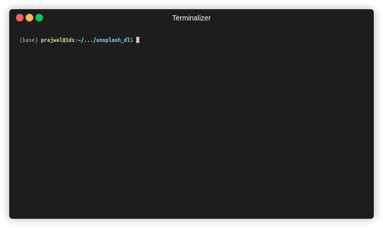
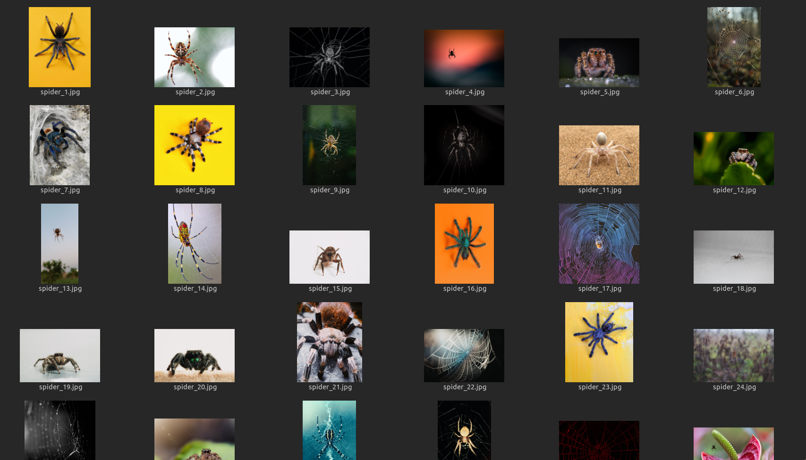
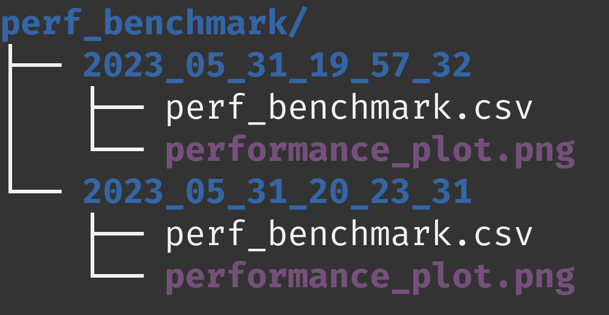
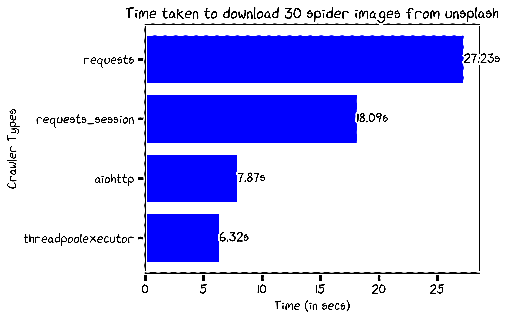
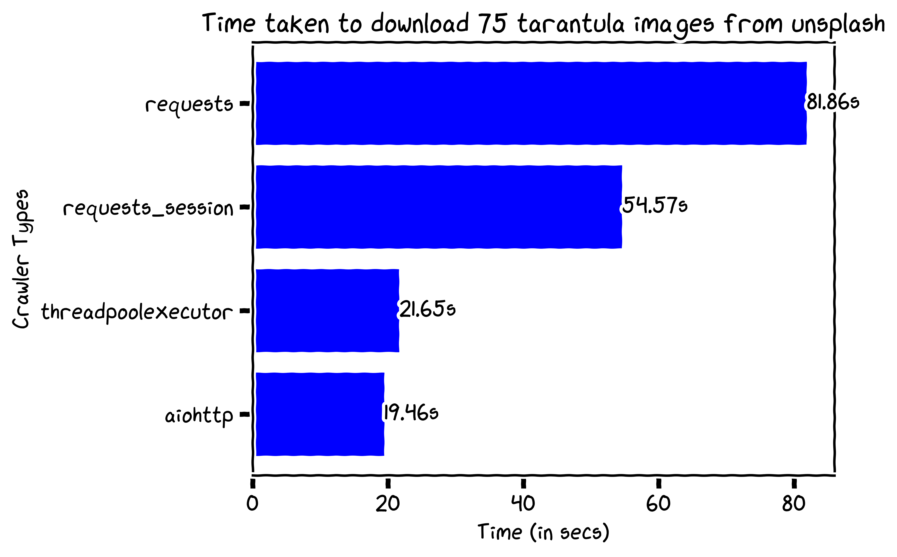

<h1 align="center">Unsplash image downloader</h1>

## 📍Overview

The project provides a set of tools for web scraping Unsplash for free images based on a keyword. It offers various image download functions that use different libraries to download images concurrently and includes options to benchmark the performance of each download method. The project's value proposition lies in its ability to provide a comprehensive set of tools for image downloads and benchmarking that can help users make informed decisions about the most efficient download method for their needs.

---
## 💻 Modules

| File                         | Summary                                                                                                                                                                                                                                                                                                                                                                                                                      | Module                       |
|:-----------------------------|:-----------------------------------------------------------------------------------------------------------------------------------------------------------------------------------------------------------------------------------------------------------------------------------------------------------------------------------------------------------------------------------------------------------------------------|:-----------------------------|
| plot_perf_benchmark.py       | The code defines a function to plot data from a CSV file into a horizontal bar graph. The data is extracted and sorted before being plotted with xkcd styling. The function also saves the plot as an image file and displays the graph.                                                                                                                                                                                     | plot_perf_benchmark.py       |
| unsplash_image_downloader.py | The provided code is an image downloader that scrapes Unsplash for free images based on a given keyword and downloads them using four different methods-requests, requests session, aiohttp, and threadpoolexecutor. It includes an option to benchmark all downloader methods and output a performance report with a plot. The code also provides an argparse interface for user input.                                     | unsplash_image_downloader.py |
| downloaders.py               | The provided code snippet offers four different image download functions that use various libraries and techniques such as requests, aiohttp, and ThreadPoolExecutor to download images concurrently. These functions take a keyword, a list of image links, and the number of images to download, and save the images in a specified base folder. The tqdm library is used to display progress bars during image downloads. | downloaders.py               |

<br>

---

## 📸 Screenshots

### 1. Downloading 5 redpanda images from unsplash

```
python unsplash_image_downloader.py --keyword redpanda --image_count 5
```



### 2. Downloading 30 spider images from unsplash

```
python unsplash_image_downloader.py --keyword spider --image_count 30 --benchmark 3
```

 - The same set of images is downloaded using all download methods.
 - This is repeated 3 times to get an average of the elapsed time.
 - The benchmark scores are stored as a CSV.
 - The benchmark scores CSV is plotted, and the plot is saved to a file.


#### Downloaded images


#### Performance benchmark



