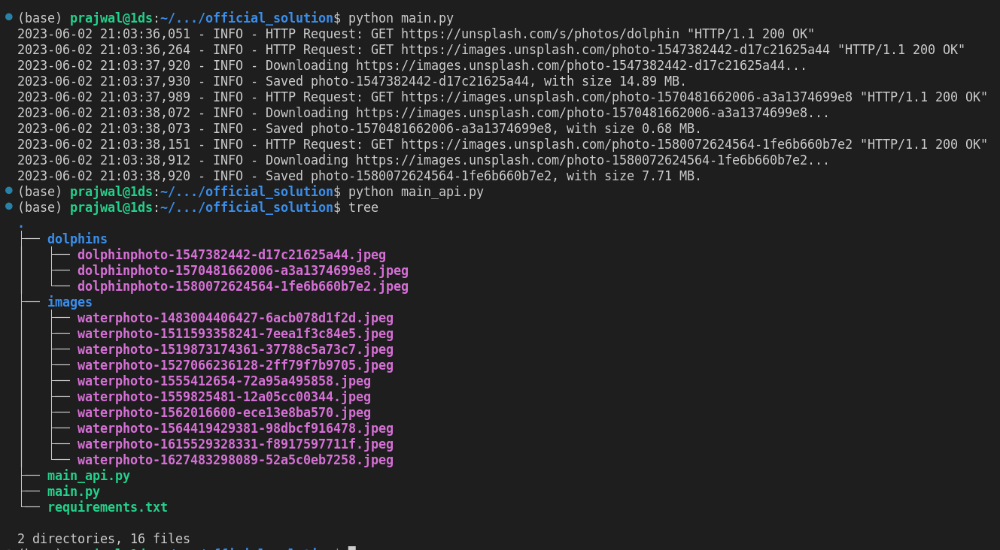

<h1 align="center">
Unsplash image downloader (official solution)
</h1>

## 📍Overview

This project provides code to scrape and download high-quality images related to a given search term from the Unsplash website. The code uses various third-party libraries to filter out unsuitable URLs and download a specified number of images to a given destination directory. Its core functionalities enable users to automate the time-consuming task of searching, filtering, and downloading images manually. The project's value proposition lies in its ability to save users' time and effort while delivering high-quality images relevant to their search queries.

## 💻 Modules

| File        | Summary                                                                                                                                                                                                                                                                                                                                                                                                                                                                                                                |
|:------------|:-----------------------------------------------------------------------------------------------------------------------------------------------------------------------------------------------------------------------------------------------------------------------------------------------------------------------------------------------------------------------------------------------------------------------------------------------------------------------------------------------------------------------|
| main.py     | The provided code snippet has three main functions. First, it retrieves a list of high-resolution images' URLs related to a given search term from the Unsplash website. Second, it filters out some unsuitable URLs from the retrieved ones. Finally, it downloads and saves a specified number of images to a given destination directory. The code heavily relies on third-party packages such as httpx and selectolax.parser and uses Python's logging module for informing the user about the process's progress. |
| main_api.py | The provided code snippet allows for scraping and downloading images from Unsplash based on a given keyword and number of desired results. The code uses the httpx library to send API requests and retrieve JSON data, and includes functions for extracting image URLs, downloading images, and iterating through multiple pages of results.                                                                                                                                                                         |

## 📸 Screenshots

